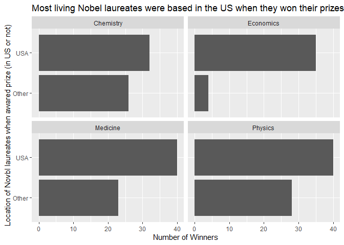

Lab 03 - Nobel laureates
================
Bob D
28Mar23

### Load packages and data

``` r
library(tidyverse) 
```

``` r
nobel <- read_csv("data/nobel.csv")
```

## Exercises

### Exercise 1

``` r
#How many variables are in the dataset?
nobel %>%
  ncol()
```

    ## [1] 26

``` r
#Each row represents a winner. Number of winners?
nobel %>%
  nrow()
```

    ## [1] 935

### Exercise 2

``` r
#Create a new data frame called nobel_living that includes only observations of living people for which country data is available. 
nobel_living <- nobel %>%
  filter(!is.na(country),gender != "org", is.na(died_date))
```

### Exercise 3

``` r
#this takes the new variable and adds a new column. If country the laureate was living in during the price year = "USA," set country to USA, if not, set to other.
nobel_living <- nobel_living %>%
  mutate(
    country_us = if_else(country == "USA", "USA", "Other")
  )

#limit our analysis to only the following categories: Physics, Medicine, Chemistry, and Economics
nobel_living_science <- nobel_living %>%
  filter(category %in% c("Physics", "Medicine", "Chemistry", "Economics"))

#data visualization - Create a faceted bar plot visualizing the relationship between the category of prize and whether the laureate was in the US when they won the nobel prize.

nobel_living_science %>%
  ggplot(aes(x = country_us)) +
  geom_bar() +
  coord_flip() +
  facet_wrap(~ category) +
  labs(title = "Most living Nobel laureates were based in the US when they won their prizes",
       x = "Location of Novbl laureates when awared prize (in US or not)",
       y = "Number of Winners") 
```

<!-- --> \### Exercise
4

### Exercise 5

### Exercise 6
